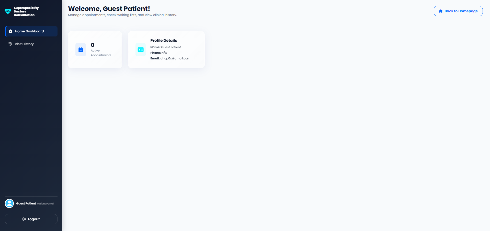
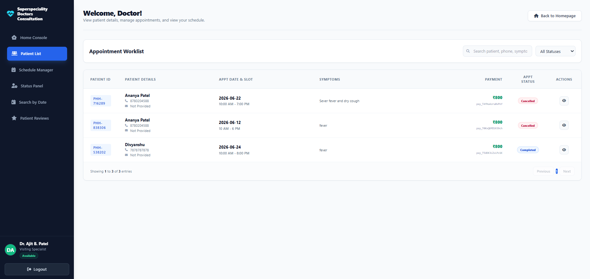

# Hospital Website

A full-stack hospital management web application with role-based dashboards for patients, doctors, receptionists, and administrators. Patients can browse specialties, book appointments, log in securely via email OTP, and pay online, while staff manage schedules, doctors, and appointments from dedicated portals.

## Screenshots

> Add your screenshots to a `screenshots/` folder and update the paths below.

| Home | Patient Dashboard |
| --- | --- |
|  |  |

| Portal Login | Doctor Dashboard |
| --- | --- |
|  |  |

## Features

- **Role-based portals** — separate dashboards for patients, doctors, receptionists, and administrators.
- **Secure authentication** — JWT-protected endpoints with `bcrypt` password hashing.
- **Email OTP login** — one-time passwords delivered via SMTP (Nodemailer).
- **Appointment booking** — patients book against doctor availability; booking is blocked when a doctor is not Available.
- **Doctor schedule management** — real-time Available / Offline status synced across dashboards.
- **Online payments** — integrated Razorpay checkout (sandbox-ready).
- **PDF generation** — printable/downloadable documents via jsPDF + AutoTable.
- **Specialties browsing** — patients explore departments and doctors before booking.

## Tech Stack

**Frontend**
- HTML5, vanilla JavaScript
- React 18 + React Router (`src/`)
- Tailwind CSS, PostCSS, Autoprefixer
- Vite (dev server & build)

**Backend**
- Node.js + Express 5
- PostgreSQL (`pg`)
- JSON Web Tokens for auth, `bcrypt` for hashing

**Integrations**
- Razorpay (payments)
- Nodemailer (SMTP email / OTP)
- jsPDF & jsPDF-AutoTable (PDF export)

**Deployment**
- Vercel (`vercel.json`)

## Installation

### Prerequisites
- [Node.js](https://nodejs.org/) (v18+ recommended)
- A running [PostgreSQL](https://www.postgresql.org/) database

### Setup

1. **Clone the repository**
   ```bash
   git clone https://github.com/heyyananya/hospital-website.git
   cd hospital-website
   ```

2. **Install dependencies**
   ```bash
   npm install
   ```

3. **Configure environment variables**

   Create a `.env` file in the project root:
   ```env
   # PostgreSQL Database
   DB_USER=your_db_user
   DB_PASSWORD=your_db_password
   DB_HOST=localhost
   DB_PORT=5432
   DB_DATABASE=hospital

   # Server
   PORT=3000

   # Razorpay (sandbox)
   RAZORPAY_KEY_ID=your_key_id
   RAZORPAY_KEY_SECRET=your_key_secret

   # SMTP / Email OTP
   SMTP_HOST=smtp.example.com
   SMTP_PORT=587
   SMTP_SECURE=false
   SMTP_USER=your_smtp_user
   SMTP_PASS=your_smtp_password
   SMTP_FROM="Hospital <no-reply@example.com>"
   ```

4. **Run the app**

   Start the backend server:
   ```bash
   npm start
   ```

   Or run the Vite dev server (frontend):
   ```bash
   npm run dev
   ```

5. **Build for production**
   ```bash
   npm run build
   ```

## License

ISC
